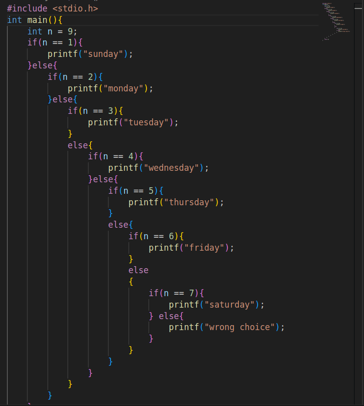

# DAY 2
#### Q1 wap to print 3 numbers in increasing order
    ans: in sort3numbers.c

### Problem in nested if else 
- introduction of else if

- ElIf is a preprocessor directive in c

# Keywords in  C are 32
- switch 
- case
- default
- break

# Switch
- only int constant is allowed in case eg: 
```c
switch(day){
    case 1: printf("hello world");
        break;
}
```
- case 'a'   allowed
- case  5+4-2    allowed
- case 98 & case 'b'   gives duplicate error

### Recently switch case can take range
```c
    switch(){
        case 90 ... 100:
    }
```

| Ascii | Range     |
| ------ | -------- |
| 'a'-'z'| 97 to 122 |
| 'A'-'Z'| 65 to 90  |
| '0'-'9'| 48 to 57  |
| space | 32        |

### WAP for lowercase to uppercase
- using ascii
- without using ascii
- using predefined function 'A' = toUpper('a') d

### Input character in c using
```c
// Different methods
 scanf("%c" , & c);
 ch = getchar();
 ch = getche()
 ch = getch();
```

## check the uppercase or not
```c
    char ch;
    printf(toUpper(ch));  // convert to upper case
    printf(toLower(ch));  // convert to lower case
    printf(isUpper(ch));  // check's if it is  upper case
    printf(isLower(ch));  // check's if it is lower case
    printf(isdigit(ch));

```

---
# OPERATOR
 ```c
    5            +             4
    operand    operator      operand
 ```

 ### Types of operator
- unary(1)   eg. a++
- binary (2)    eg. 5 + 4
- ternary (3)   ? :

#### Airtmetic operator
`
  low precedence + -  
`

`
  high precedence * / % 
`

###  rules of  associativity 
in notebook


## ERROR types
- compile time error
- run time error            
 ` printf(5/0); `
- logical error


## modulus
- 5 % 2 = 1
- 5.1 % 2 = Compile time error (Solution fmod(5.1,2))
- -5 % 2  = -1
- 5 % -2  = 1
- -5 % -2 = -1
- 2 % 5  = 2
- 0 % 5  = 0
- 5 % 0 = RT error
- 'a' % 'b' = 97

```c
    5 - 7 / 14 * 2 - 15 % 6 * 3 -7 % 9 * 2 + 15
ans: 5 - 0  - 9 -7 *2 + 15
ans: 5 -9 -14 + 15
ans: -3 
```